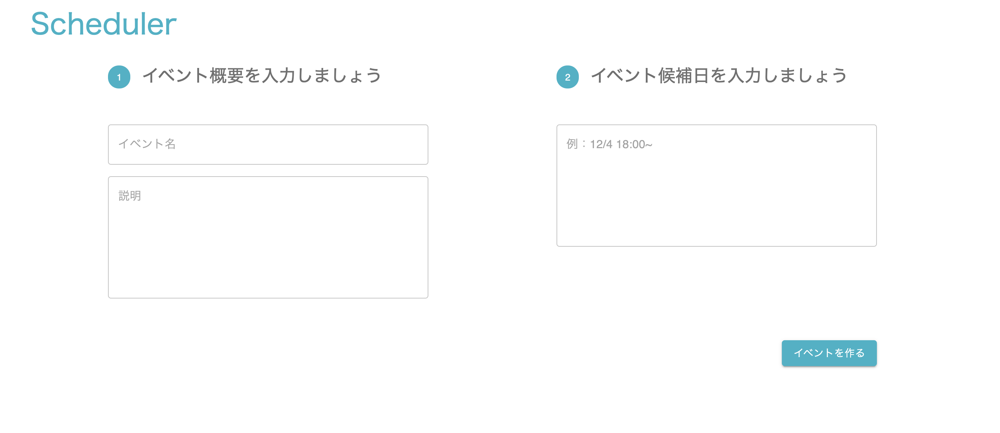

# 1.イベントを登録する

### 画面イメージ




### 対象ファイル

- <project_root>/src/EventEntry.js

### 完成コード

初めに、完成コードを示しておきます。

<details><summary>1.イベントを登録する</summary><div>

```javascript
import React, { useState } from 'react';
import { withRouter } from 'react-router';
import { firebaseApp } from './config/firebase'
import Grid from '@material-ui/core/Grid';
import Button from '@material-ui/core/Button';
import Chip from '@material-ui/core/Chip';
import { TextField } from '@material-ui/core';

import './EventEntry.css';

const firebaseDb = firebaseApp.database();

const EventEntry = (props) => {
    // 1-1.入力フォームの内容をstateに反映しよう
    // イベント名
    const [eventName, setEventName] = useState('')
    // 説明
    const [description, setDescription] = useState('')
    // イベント候補日
    const [possibleDateText, setPossibleDateText] = useState('')

    // "イベントを作る"ボタンを押すとregisterEvent関数が起動します。
    const registerEvent = async () => {
        const possibleDates = possibleDateText.split('\n')
        // 1-3-1.入力した値を整形しよう
        const eventData = {
            name: eventName,
            description: description,
            dates: possibleDates
        }
        // 1-3-2.Realtime Databaseに整形した値を書き込もう
        firebaseDb.ref("events").push(eventData);
        // 1-4.イベントIDを取得して画面遷移しよう
        const eventId = firebaseDb.ref("events").push(eventData).key;
        props.history.push(`/event/${eventId}`);
    };


    return (
        <Grid
            id="event-entry"
            container
            item
            direction="row"
            justify="space-between"
            alignItems="flex-start"
            xs={9}
            >
                <Grid container item xs={5} justify="flex-start">
                    <div className="guide-title">
                        <Chip color="primary" label="1" className="guide-title__chip"/>
                        イベント概要を入力しましょう
                    </div>
                    <TextField
                    placeholder="イベント名"
                    //1-1入力された値をstateで管理しましょう
                    onChange={evt => setEventName(evt.target.value)}
                    // 1-2.入力フォームの内容をstateから取得して表示しよう
                    value={eventName}

                    fullWidth={true}
                    variant="outlined"
                    />
                    <TextField
                    placeholder="説明"
                    //1-1入力された値をstateで管理しましょう
                    onChange={evt => setDescription(evt.target.value)}

                    // 1-2.入力フォームの内容をstateから取得して表示しよう
                    value={description}
                    margin="normal"
                    multiline
                    rows={7}
                    fullWidth={true}
                    variant="outlined"
                    />
                </Grid>
                <Grid container item xs={5} justify="flex-start">
                    <div className="guide-title">
                        <Chip color="primary" label="2" className="guide-title__chip"/>
                        イベント候補日を入力しましょう
                    </div>
                    <TextField
                    placeholder="例：12/4 18:00~"
                    value={possibleDateText}
                    onChange={evt => setPossibleDateText(evt.target.value)}

                    className="Guide-title"
                    multiline
                    rows={7}
                    fullWidth={true}
                    variant="outlined"
                    />
                </Grid>
                <Grid container item xs={12} justify="flex-end" className="button-area">
                    <Grid item>
                        <Button
                            variant="contained"
                            color="primary"
                            onClick={() => registerEvent()}>
                            イベントを作る
                        </Button>
                    </Grid>
                </Grid>
        </Grid>
    );
}

export default withRouter(EventEntry);
```

</div></details>

---
## 1-1.入力フォームの内容をstateに反映しよう

入力フォームに入力された内容を`state`に保存します。
対象箇所は`イベント名 eventName`と`説明 description`の入力フォームです。  
イベント候補日は既に作成済です。

### 対象ファイル

- <project_root>/src/EventEntry.js 

以下のように、[useState](https://ja.reactjs.org/docs/hooks-reference.html#usestate)関数を利用してReactの`state`の機能をコンポーネントに追加できます。  

``` javascript
const [possibleDateText, setPossibleDateText] = useState('')
```

`useState`関数を呼ぶと`state`と、`state`を更新するための関数とを配列で返します。
ここでは`possibleDateText`がstate、`setPossibleDateText`がstateを更新するための関数です。  
`useState`関数の引数に渡した値は`stateの初期値`になります。  
`イベント名 eventName`と`説明 description`のstateが定義されていないので、定義しましょう。  
初期表示時では何も表示しないために`stateの初期値`には空文字`''`を設定しておきましょう。

<br/>

`state`が定義できたら、フォームに入力された値を`state`で保持します。  
対応する入力フォームの部品の`onChange`属性に処理を記述することで入力された値を扱うことができます。  
以下のイベント候補日の記述を参考にして、イベント名と説明も同様に`state`に保持するようにしましょう。  

``` javascript
<TextField
    placeholder="例：12/4 18:00~"
    onChange={evt => setPossibleDateText(evt.target.value)}
    略
/>
```

`state`の値を変更するとReactは最新の`state`の値を用いてコンポーネントを再レンダーします。

### 完成コード例

<details><summary>1-1.入力フォームの内容をstateに反映しよう(stateを追加)</summary><div>

``` javascript
// イベント名
const [eventName, setEventName] = useState('')
// 説明
const [description, setDescription] = useState('')
```

</div></details>
<details><summary>1-1.入力フォームの内容をstateに反映しよう(stateで保持)</summary><div>

``` javascript

<Grid container item xs={5} justify="flex-start">
    <div className="guide-title">
        <Chip color="primary"label="1"className="guide-title__chip">
        イベント概要を入力しましょう
    </div>
    <TextField
        placeholder="イベント名"
        onChange={evt => setEventName(evt.target.value)}
        value={eventName}
        fullWidth={true}
        variant="outlined"
    />
    <TextField
        placeholder="説明"
        onChange={evt => setDescription(evt.targetvalue)}
        value={description}
        margin="normal"
        multiline
        rows={7}
        fullWidth={true}
        variant="outlined"
    />
</Grid>
```

</div></details>

---
## 1-2.入力フォームの内容をstateから取得して表示しよう

先程、入力した値を`state`に保存したので、表示するときにも`state`から値を取得するようにしましょう。

### 対象ファイル

- <project_root>/src/EventEntry.js

入力フォームに`state`の値を表示させるために、`value`属性に`state`の内容を反映します。
以下のコード例を参考に`イベント名`と`説明`もstateの値を表示させましょう。  

``` javascript
<TextField
    placeholder="例：12/4 18:00~"
    value={possibleDateText}
    onChange={evt => setPossibleDateText(evt.target.value)}
/>
```

`stateを更新する関数`で値が書き換わるとコンポーネントが再レンダーされるので、ここの`<TextField>`の`value`も最新の`state`に書き換わります。

### 完成コード例

<details><summary>1-2.入力フォームの内容をstateから取得して表示しよう</summary><div>

```javascript
<TextField
    placeholder="イベント名"
    onChange={evt => setEventName(evt.target.value)}
    value={eventName}
    略
/>
<TextField
    placeholder="説明"
    onChange={evt => setDescription(evt.targetvalue)}
    value={description}
    略
/>
```

</div></details>

---
## 1-3.入力した値をRealtime Databaseに書き込もう

`イベントを作る`ボタンを押すと`state`に保存した値をRealtime Databaseに書き込むという処理を追加します。  
`イベントを作る`ボタンを押した時に起動する関数として`registerEvent`関数を用意しています。  
この中に処理を追加しましょう。

### 対象ファイル

- <project_root>/src/EventEntry.js

ここまでの作業でイベントデータの登録に必要な値を`state`に保存することができました。

``` javascript
{
    // イベント名
    const [eventName, setEventName] = useState('')
    // 説明
    const [description, setDescription] = useState('')
    // イベント候補日
    const [possibleDateText, setPossibleDateText] = useState('')
}
```

このデータをFirebaseのRealtime Databaseに書き込みます。

今回は、以下のような形でRealtime Databaseにイベント情報を登録しましょう。

```javascript
{
  "events" : {
    "-Mxxxxxxxxxxxxxxx" : {
      "name" : "忘年会",
      "description" : "忘年会やります!",
      "dates" : [ "12/29", "12/30" ]
    }
  }
}
```


データベース内の`events`配下にイベントを登録します。  
その際、書き込んだイベントデータごとに一意になるキーをFirebaseが自動で生成、付与してくれます。  
上の例の`-Mxxxxxxxxxxxxxxx`が自動で生成されたキーです。  

新しいイベントを登録する度、`events`配下にイベントのオブジェクトが増えていく、という構成です。

---

### 1-3-1.入力した値を整形しよう
まず、入力した値をRealtime Databaseに書き込む形へ整形します。  

`state`のデータ
``` javascript
eventName === "忘年会",
description === "忘年会やります!",
possibleDateText === "12/29\n12/30"
```

Realtime Databaseへ書き込む形

``` javascript
{
    "name" : "忘年会",
    "description" : "忘年会やります!",
    "dates" : [ "12/29", "12/30" ]
}
```

`possibleDateText`のデータを改行区切りで配列にする処理は既に書かれています。  
区切り文字（今回の場合は`\n`）を使って配列を作る処理には、[split関数](https://developer.mozilla.org/ja/docs/Web/JavaScript/Reference/Global_Objects/String/split)を使用しています。

``` javascript
const possibleDates = possibleDateText.split('\n')
// possibleDatesの値は[ "12/29", "12/30" ]
```

書き込むデータをJSON形式で定義します。
中括弧で囲んだ中の左側に`要素名`、右側に`値`を書きます。  
要素名と値のセットの区切りには`,`を書きます。


### 完成コード例

<details><summary>1-3-1.入力した値を整形しよう</summary><div>

``` javascript
const registerEvent = () => {
    const possibleDates = possibleDateText.split('\n')
    const eventData = {
        name: eventName,
        description: description,
        dates: possibleDates
    }
};
```

</div></details>
---

### 1-3-2.Realtime Databaseに整形した値を書き込もう

Realtime Databaseでデータの読み書きを行うには、`firebase.database.Reference`のインスタンスが必要です。
これは、<project_root>/src/EventEntry.jsの11行目で生成しています。

```javascript
const firebaseDb = firebaseApp.database();
```

Realtime Databaseでデータを書き込む時は、データを書き込むパスとメソッドを指定します。  
まずデータを書き込むパスですが、1-3.の冒頭で書いた通り`events`配下に保存したいので、パスは`events`にします。  
また、メソッドについてはイベントごとに一意のキーを付与したいので、[push()](https://firebase.google.com/docs/database/web/save-data#append_to_a_list_of_data)を選択します。  
そのため、データベースにデータを書き込む際は以下のようなコードになります。  

```javascript
firebaseDb.ref("パス").push(書き込むデータ);
```

### 完成コード例

<details><summary>1-3-2.Realtime Databaseに整形した値を書き込もう</summary><div>

```javascript
const registerEvent = () => {
    const possibleDates = possibleDateText.split('\n')
    const eventData = {
        name: eventName,
        description: description,
        dates: possibleDates
    }
    firebaseDb.ref("events").push(eventData);

    // props.history.push(`/event/${eventId}`);
};
```

</div></details>

### データベース確認（任意）
データがRealtime Databaseに保存されたことを確認します。
FirebaseコンソールのサイドメニューでDatabaseを選択し、データを見てみましょう。

---
## 1-4.イベントIDを取得して画面遷移しよう

### 対象ファイル

- <project_root>/src/EventEntry.js

`push()`関数の戻り値には自動生成されたキーの値が含まれており、以下のように自動生成されたキーが取得できます。

```javascript
const eventId = firebaseDb.ref("パス").push(書き込みデータ).key;
```

このキーをイベントIDとして、次の画面のURLに遷移します。(例えば、キーが`-Mxxxxxxxxxx`の場合、`/event/-Mxxxxxxxxxx`に遷移します)。

以下のようにReact Routerの設定をしています。

``` javascript
import { withRouter } from 'react-router';
// 中略
export default withRouter(EventEntry);
```

これによって、コンポーネントのpropsから画面遷移に利用する`history`オブジェクトや`match`オブジェクトを受け取れるようになります。  
参考リンク:https://reacttraining.com/react-router/web/api/withRouter  


`history`の`push()`関数を使って次画面のURLを設定しページ遷移します。  
ページ遷移の処理はコメントアウトされているので、コメントアウトを外しましょう。

``` javascript
props.history.push(`遷移先へのパス`);
```

### 完成コード例

<details><summary>1-4.イベントIDを取得して画面遷移しよう</summary><div>

```javascript
const registerEvent = async () => {
    const possibleDates = possibleDateText.split('\n')
    const eventData = {
        name: eventName,
        description: description,
        dates: possibleDates,
        attendees: []
    }
    const eventId = firebaseDb.ref("events").push(eventData).key;

    props.history.push(`/event/${eventId}`);
};
```

</div></details>

---

これでイベント登録画面の作成は完了です。  
[イベント詳細を表示する](./02_イベント詳細を表示する.md)に進んでください。


