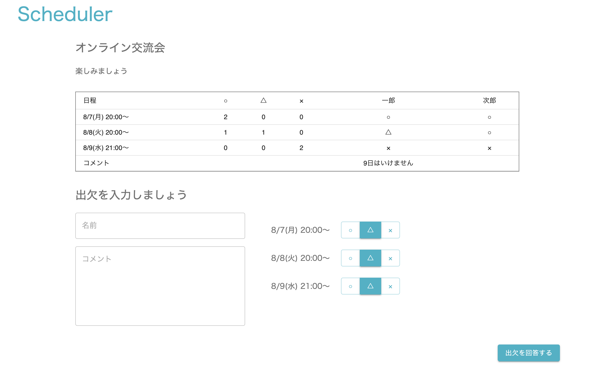

# 2.イベント詳細を表示する

### 画面イメージ




### 対象ファイル

- <project_root>/src/Event.js

### 完成コード

初めに、全体の完成コードを示しておきます。
<details><summary>2.イベント詳細を表示する</summary><div>

``` javascript
import React, { useEffect, useState } from 'react';
import { withRouter } from 'react-router';
import { firebaseApp } from './config/firebase'
import Grid from '@material-ui/core/Grid';
import Button from '@material-ui/core/Button';
import { TextField } from '@material-ui/core';
import {AttendanceTable, DateButtonGroup} from "./parts"
import { attendeesObjectToArray } from "./DataConvert";

import './Event.css';

const firebaseDb = firebaseApp.database();

const Event = (props) => {
    const [name, setName] = useState('');
    const [comment, setComment] = useState('');
    // 2-1.ダミーデータを確認しよう
    // コメントアウトを外してください
    const [event, setEvent] = useState({
        name: "",
        description: "",
        dates: [],
        attendees: []
      });
    const [possibleDates, setPossibleDates] = useState([]);

    // 2-1.ダミーデータを確認しよう
    // コメントアウトしてください
    // const [event, setEvent] = useState({
    //     name: "オンライン交流会",
    //     description: "楽しみましょう",
    //     dates: [ "8/7(月) 20:00～", "8/8(火) 20:00～", "8/9(水) 21:00～" ],
    //     attendees: [
    //       {
    //         name: "一郎",
    //         votes: [ "○", "△", "×" ],
    //         comment: '9日はいけません'
    //       },{
    //         name: "次郎",
    //         votes: ["○", "○", "×"],
    //         comment: ''
    //       }
    //     ]
    //   });
    // const [possibleDates, setPossibleDates] = useState([
    //     {
    //         date: "8/7(月) 20:00～",
    //         vote: '△'
    //     },
    //     {
    //         date: "8/8(火) 20:00～",
    //         vote: '△'
    //     },
    //     {
    //         date: "8/9(水) 21:00～",
    //         vote: '△'
    //     },
    // ]);


    useEffect(() => {
        // 2-2-1.イベントIDを取得しよう
        const eventId = props.match.params.id;
        // 2-2-2.Realtime Databaseから取得するデータを特定しよう
        firebaseDb.ref(`events/${eventId}`).on("value", snapshot => {
            // 2-2-3.Realtime Databaseからデータを取得しよう
            const eventData = snapshot.val();
            // 2-4.イベント名、説明文、候補日程を表示させよう
            setEvent({
                name: eventData.name,
                description: eventData.description,
                dates: eventData.dates,
                attendees: []
            });
            // 2-5.候補日程を表示用に編集しよう
            const newPossibleDate = eventData.dates.map(date => {
                return {
                    date: date,
                    vote: '△'
                }
            })
            setPossibleDates(newPossibleDate);
          });
    },[setEvent, setPossibleDates, props.match.params.id]);

    // 出欠回答欄で選択された◯△×の情報はこの関数でstateに保存しています。
    const onSelectVote = (targetDate, selectedVote) => {
        const newPossibleDates  = possibleDates.map(possibleDate => {
                return (possibleDate.date === targetDate) ?
                    { ...possibleDate, vote:selectedVote } :
                    possibleDate;
            });
        setPossibleDates(newPossibleDates);
    };

    // 名前入力欄、コメント入力欄、出欠選択欄のstateを初期状態に更新する関数
    const initializeAttendances = () => {
        setName('');
        setComment('');
        setPossibleDates(event.dates.map(date => {
            return {
                date: date,
                vote: '△'
            }
        }));
    };


    // "出欠を回答する"ボタンを押すとこの関数が呼び出されます。
    const registerAttendances = async() => {
        // 2-6.出欠情報登録機能を追加しよう
        // 出欠情報をRealTimeDatabaseに登録しましょう
    };

    return (
        <Grid
            id="event"
            container
            item
            justify="space-between"
            alignItems="flex-start"
            xs={9}
            spacing={4}
        >
            <Grid container item xs={12} direction="column" justify="flex-start" alignItems="flex-start">
                <Grid item className="guide-title">
                    {event.name}
                </Grid>
                <Grid item className="guide-message">
                    {event.description}
                </Grid>
            </Grid>
            <Grid container item xs={11} direction="column" justify="flex-start" alignItems="flex-start">
                <AttendanceTable columns={event.dates} attendees={event.attendees} />
            </Grid>
            <Grid container item xs={11} justify="space-between" spacing={4}>
                <Grid container item xs={5} justify="flex-start" direction="column">
                    <Grid item className="guide-title">
                        出欠を入力しましょう
                    </Grid>
                    <Grid item>
                        <TextField
                            placeholder="名前"
                            value={name}
                            onChange={e => setName(e.target.value)}
                            fullWidth={true}
                            variant="outlined"
                        />
                        <TextField
                            margin="normal"
                            placeholder="コメント"
                            multiline
                            rows={7}
                            value={comment}
                            onChange={e => setComment(e.target.value)}
                            fullWidth={true}
                            variant="outlined"
                        />
                    </Grid>
                </Grid>
                <Grid container item xs={7} spacing={3} justify="center" alignItems="flex-start" direction="column">
                    {possibleDates.map((possibleDate) => {
                        return (
                            <DateButtonGroup
                                key={possibleDate.date}
                                date={possibleDate.date}
                                vote={possibleDate.vote}
                                onSelectVote={(vote) => onSelectVote(possibleDate.date, vote)}
                            />
                        )
                    })}
                </Grid>
            </Grid>
            <Grid container item xs={12} justify="flex-end" alignItems="flex-start">
                <Button
                    variant="contained"
                    color="primary"
                    onClick={() => registerAttendances()}>
                    出欠を回答する
                </Button>
            </Grid>
        </Grid>
    );
}

export default withRouter(Event);
```

</div></details>

---
## 2-1.ダミーデータを確認しよう

イベント詳細画面で新たにイベントを作成し、イベント詳細画面にアクセスしてみてください。

初期状態ではサーバにアクセスせず、ローカルのダミーデータを表示するようになっています。  
ダミーデータではなく、サーバから取得したデータを表示するようにしましょう。  
ダミーデータはstateの初期値として設定しています。  
ダミーデータを初期値にしている部分をコメントアウトし、すぐ上でstateを定義している箇所のコメントアウトを外しましょう。

eventのオブジェクトに`attendees`という要素が含まれている部分に注意してください。  
`attendees`はイベント詳細画面で登録される出席者の情報です。  

`possibleDates`はイベント詳細画面に表示されている○△×の入力ボタン項目の値を管理する変数です。  

### 完成コード例

<details><summary>2-1.ダミーデータを確認しよう</summary><div>

```javascript
    // 2-1.ダミーデータを確認しよう
    // コメントアウトを外してください
    const [event, setEvent] = useState({
        name: "",
        description: "",
        dates: [],
        attendees: []
      });
    const [possibleDates, setPossibleDates] = useState([]);

    // 2-1.ダミーデータを確認しよう
    // コメントアウトしてください
    // const [event, setEvent] = useState({
    //     name: "オンライン交流会",
    //     description: "楽しみましょう",
    //     dates: [ "8/7(月) 20:00～", "8/8(火) 20:00～", "8/9(水) 21:00～" ],
    //     attendees: [
    //       {
    //         name: "一郎",
    //         votes: [ "○", "△", "×" ],
    //         comment: '9日はいけません'
    //       },{
    //         name: "次郎",
    //         votes: ["○", "○", "×"],
    //         comment: ''
    //       }
    //     ]
    //   });
    // const [possibleDates, setPossibleDates] = useState([
    //     {
    //         date: "8/7(月) 20:00～",
    //         vote: '△'
    //     },
    //     {
    //         date: "8/8(火) 20:00～",
    //         vote: '△'
    //     },
    //     {
    //         date: "8/9(水) 21:00～",
    //         vote: '△'
    //     },
    // ]);
```

</div></details>

---
## 2-2.Realtime Databaseからイベント情報を取得しよう

`useEffect`関数の中にRealtime Databaseからイベント情報を取得する処理を追加していきます。

### 対象ファイル
- <project_root>/src/Event.js

[useEffect](https://ja.reactjs.org/docs/hooks-reference.html#useeffect)関数はデフォルトでは毎回のレンダー後に呼び出されます。  
今回は画面遷移した後、自動的に呼び出されます。  


---
### 2-2-1.イベントIDを取得しよう

直前の画面で作成したイベント情報を取得するため、イベント情報登録時に自動生成された`イベントID`を取得します。  

`イベントID`は画面遷移後のURLから取得します。  
```
イベント詳細画面へのパス
http://localhost:3000/event/-Mxxxxxxxxxxxxxxx 
```

イベント詳細画面は以下のようなルーティング設定になっています。 
```
<Route exact path='/event/:id' component={Event} />
```
URL末尾の`id`は、以下のようにReact RouterのAPIから取得できます(propsに自動的に設定されます)。

``` javascript
const eventId = props.match.params.id;
```
今回はURLから`eventId`を取得する処理は既に記載済のため、対象箇所を確認して次の作業に進みましょう。  

### 完成コード例

<details><summary>2-2-1.イベントIDを取得しよう</summary><div>

``` javascript
useEffect(() => {
        const eventId = props.match.params.id;
    });
```

</div></details>

---

### 2-2-2.Realtime Databaseから取得するデータを特定しよう
Realtime Databaseからのデータの読み取りには書き込みの時と同じように、`firebase.database.Reference`のインスタンスが必要です。  
これは、<project_root>/src/Event.jsの12行目で生成しています。

```javascript
const firebaseDb = firebaseApp.database();
```

データ書き込みの時と同じように`firebase.database.Reference`のインスタンスに、欲しいデータへのパスを指定します。  
ここでは以下の通り、events配下のデータを事前に取得した`eventId`を利用して特定します。  

```javascript
//データベースに格納されている情報
{
  events : {
    -Mxxxxxxxxxxxxxxx : {
      name : "忘年会",
      description : "忘年会やります!",
      dates : [ "12/29", "12/30" ]
    },
    -Mxxxxxxxxxxxxxxx : {
      name : "新年会",
      description : "新年会しましょう!",
      dates : [ "1/15", "1/16" ]
    },
  }
}
```
パスの指定には[テンプレートリテラル](https://developer.mozilla.org/ja/docs/Web/JavaScript/Reference/Template_literals)を利用しているため、バッククォートを使う部分に注意してください。  

### 完成コード例

<details><summary>2-2-2.Realtime Databaseから取得するデータを特定しよう</summary><div>

``` javascript
useEffect(() => {
        const eventId = props.match.params.id;
        firebaseDb.ref(`events/${eventId}`)
    });
```

</div></details>

---

### 2-2-3.Realtime Databaseからデータを取得しよう

データの取得には[on()](https://firebase.google.com/docs/reference/node/firebase.database.Reference#on)関数を利用します。  
この`on()`関数は呼び出された初回に1度データを取得した後、取得先のデータに変更がある度に再度データが取得されます。  
`on()`関数の第一引数に、そのデータの変更を検知する条件である`イベント`を指定するための文字列を渡します。  
今回は指定したパス全体に対する変更を検知する[value](https://firebase.google.com/docs/database/web/read-and-write#listen_for_value_events)イベントを使用します。

```javascript
firebaseDb.ref(`events/${eventId}`).on("イベント", snapshot => {
  const eventData = snapshot.val();
)}
```

データ取得結果は`on()`関数の第二引数のコールバック関数の引数として渡されます。  
上の例では`snapshot`が[データ取得結果](https://firebase.google.com/docs/reference/node/firebase.database.DataSnapshot)にあたります。  
`データ取得結果`の[val()](https://firebase.google.com/docs/reference/node/firebase.database.DataSnapshot#val)関数を利用することで
以下ような形でイベントのデータが取得できます。
```javascript
const eventData =
  {
      name: "忘年会",
      description: "忘年会やります!",
      dates: [ "12/29", "12/30" ]
  }
```

### 完成コード例

<details><summary>2-2-3.Realtime Databaseからデータを取得しよう</summary><div>

``` javascript
useEffect(() => {
        const eventId = props.match.params.id;
        firebaseDb.ref(`events/${eventId}`).on("value", snapshot => {
            const eventData = snapshot.val();
        });
    });
```

</div></details>

---
## 2-3.取得したデータをstateに格納する際の対応付けを確認しよう

取得したデータを表示させるため、`state`に格納します。

`state`の構造については、`2-1.`でコメントアウトした`state`の初期値を参照してください。  
取得したデータをイベント情報`event`、出欠解答欄表示用情報`possibleDates`に設定します。

表示させる必要のある項目は以下の五つです。
* イベント名
* 説明文
* 候補日程
* 参加者出欠情報

項目とプロパティの対応は下記の通りです。

| 表示項目           | 対応するプロパティ      |
|--------------------|-------------------------|
| イベント名          | eventDetail.name |
| 説明文             | eventDetail.description |
| 候補日程            | eventDetail.dates  |
| 参加者出欠情報       | eventDetail.attendees  |

---
## 2-4.イベント名、説明文、候補日程を表示させよう

イベント名`name`、説明文`description`、候補日程`dates`はそのまま`event`stateに格納しましょう。  

### 対象ファイル

- <project_root>/src/Event.js

### 完成コード例

<details><summary>2-4.イベント名、説明文、候補日程を表示させよう①</summary><div>

``` javascript
useEffect(() => {
        const eventId = props.match.params.id;
        firebaseDb.ref(`events/${eventId}`).on("value", snapshot => {
            const eventData = snapshot.val();
             setEvent({
                name: eventData.name,
                description: eventData.description,
                dates: eventData.dates,
            });
        });
    });
```

</div></details>

2-1.でダミーデータを確認した通り、`event`stateには参加者出欠情報`attendees`の初期値も必用です。  
ここの段階ではまだデータベースの値を渡さず、`attendees`には空の配列を固定で渡すようにしましょう。
### 完成コード例

<details><summary>2-4.イベント名、説明文、候補日程を表示させよう②</summary><div>

``` javascript
useEffect(() => {
        const eventId = props.match.params.id;
        firebaseDb.ref(`events/${eventId}`).on("value", snapshot => {
            const eventData = snapshot.val();
             setEvent({
                name: eventData.name,
                description: eventData.description,
                dates: eventData.dates,
                attendees: []
            });
        });
    });
```

</div></details>

---
## 2-5.候補日程を出欠選択欄用に編集しよう

画面下段の○△×のボタンを描画するため、データベースから取得した候補日程データを編集します。  

### 対象ファイル

- <project_root>/src/Event.js

データベースから取得した候補日程は以下のような形式です。  

``` json
dates: [ "8/7", "8/8", "8/9" ]
```

これをダミーデータと同じく以下のようなデータに変換します。

``` javascript
[
    {
        date: "8/7",
        vote: '△'
    },
    {
        date: "8/8",
        vote: '△'
    },
    {
        date: "8/9",
        vote: '△'
    },
];
```

まとめると以下のような編集仕様になります。

| 編集元 | 編集先   | 備考                     |
|--------|----------|--------------------------|
| date  | date | 候補日程                 |
| -      | vote   | '△'固定(初期値)         |


配列を元に新しい配列を作るには[map関数](https://developer.mozilla.org/ja/docs/Web/JavaScript/Reference/Global_Objects/Array/map)を使います。  

以下の例では、元オブジェクトのnameに'さん'を付加し、company要素を追加した新しいオブジェクトの配列を作成しています。

``` javascript
const origin = [{ name: '山田' }, { name: '田中'}];
const newArray = origin.map(member => {
    return {
        name: `${member.name}さん`,
        company: 'TIS'
    }
});
console.log(newArray);
[ { name: '山田さん', company: 'TIS' }, { name: '田中さん', company: 'TIS' } ]
```

上記の例を参考に`eventData.dates`の配列を元に新しい配列を作りましょう。  
新しい配列ができたら、`setPossibleDates`を使って`state`の値を更新しましょう。  

``` javascript
const newPossibleDate = eventData.dates.map(date => {
        return {
            date: date,
            vote: '△'
        }
    })
setPossibleDates(newPossibleDate);
```

うまく変換できていれば、出欠選択欄が表示されます。  

### 完成コード例

<details><summary>2-5.候補日程を出欠選択欄用に編集しよう</summary><div>

``` javascript
useEffect(() => {
        const eventId = props.match.params.id;
        firebaseDb.ref(`events/${eventId}`).on("value", snapshot => {
            const eventData = snapshot.val();
             setEvent({
                name: eventData.name,
                description: eventData.description,
                dates: eventData.dates,
            });
            const newPossibleDate = eventData.dates.map(date => {
                return {
                    date: date,
                    vote: '△'
                }
            })
            setPossibleDates(newPossibleDate);
        });
    });
```

</div></details>

---
## 2-6.出欠情報登録機能を追加しよう

今の状態で`出欠を回答する`ボタンを押しても出欠情報は登録されません。  
ここまで学習したことを参考に、出欠情報登録処理と出欠情報を画面に表示する処理を追加してみましょう。  
処理を追加するにあたって必用になる情報を以下に記載しています。  
### 対象ファイル

- <project_root>/src/Event.js

### "出欠を回答する"ボタンを押すと呼び出される関数  
"出欠を回答する"ボタンを押すと`registerAttendances()`関数が呼びされるようになっています。  
`registerAttendances()`関数の中に出欠情報登録処理を追加しましょう。  


### 登録するデータの形式
データベースに`参加者出欠情報`を登録する際は以下のようにeventのデータに追加する形で登録してください。  
参加者出欠情報は`attendees`という要素名です。  
ここまでの作業でnameとdescriptionとdatesは登録済です。  

```
{
  events : {
    -Mxxxxxxxxxxxxxxx : {
        {
            name: "オンライン交流会",
            description: "楽しみましょう",
            dates: [ "8/7(月) 20:00～", "8/8(火) 20:00～", "8/9(水) 21:00～" ],
            attendees: {
                -Mxxxxxxxxxxxxxxx : {
                    name: "一郎",
                    votes: [ "○", "△", "×" ],
                    comment: "9日はいけません"
                },
                -Mxxxxxxxxxxxxxxx : {
                    name: "次郎",
                    votes: [ "○", "○", "×" ],
                    comment: ''
                }
            }
        }
    }
}
```

### データベースに既に登録済のデータに要素を追加する方法  
データ登録時に指定する`パス`で、`既存のデータへのパス/追加したいパス` と記載することで既に登録済のデータに要素を追加できます。  
今回の場合 `対象のeventを特定するパス/attendees` をデータ登録関数へ渡すことで追加可能です。  

### データベースに格納された参加者出欠情報を配列に置き換える方法
今回は、ハンズオンでの実装を簡単にするため、Tableで表示できるようにデータを加工する関数`attendeesObjectToArray()`を用意してEvent.jsにimportしています。  

`attendeesObjectToArray()`を利用すると以下の通りデータの構造を変えて新しい配列を返してくれます。  
```javascript
attendees: {
  -Mxxxxxxxxxxxxxxx : {
      name: "一郎",
      votes: [ "○", "△", "×" ],
      comment: "9日はいけません"
  },
  -Mxxxxxxxxxxxxxxx : {
      name: "次郎",
      votes: [ "○", "○", "×" ],
      comment: ''
  }
}

// ↓以下のように変換する

[
  {
    name: "一郎",
    votes: [ "○", "△", "×" ],
    comment: "9日はいけません"
  },
  {
    name: "次郎",
    votes: [ "○", "○", "×" ],
    comment: ''
  }
]
```


### アプリの動作確認

これでアプリが完成したので[イベント登録画面](http://localhost:3000/event)から一通りの動作確認をして見ましょう。


### 時間が余った場合は
[Firebaseで手動デプロイ](./03_Firebaseで手動デプロイ.md)に挑戦してみてください。  
