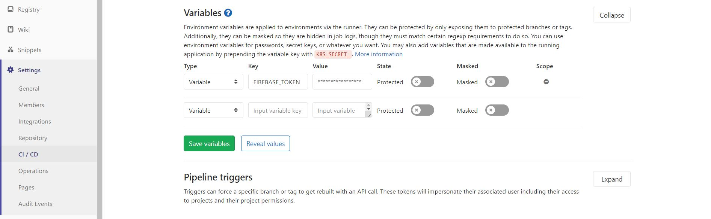
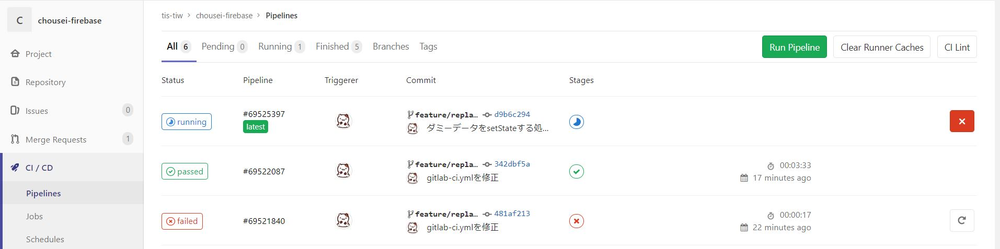

# 4.GitLabのCI/CDを設定する

GitLabのCI/CDを設定し、masterブランチにpushされたら、
自動でアプリケーションをビルド、デプロイするように設定しましょう。


## 4-1.Firebaseトークンを取得する

CI/CDからFirebaseでデプロイするために、Firebaseトークンが必要となります。

Firebase CLIでログイン後、下記のコマンドを実行してトークンを取得してください。

```cmd
firebase login:ci
```

`1/*********`がコンソールに出たら、それがFirebaseトークンです。
コピーしましょう。

---
## 4-2.FirebaseトークンをGitLab CI/CDに登録する

トークンを設定ファイル等に書いてしまうと、トークンが流出してしまいます。
これを防ぐため、Webコンソール上からGitLab CI/CDの環境変数にトークンを登録します。

GitLabにログインし、左側のメニューから`設定`->`CI/CD`を選択します。
環境変数というセクションがあります。`展開`ボタンを押すと環境変数が入力できるようになります。

以下のように、環境変数を登録します。

| キー           | 値                  |
|----------------|---------------------|
| FIREBASE_TOKEN | <コピーしたトークン> |




ここに登録しておくと、CI/CD実行時に環境変数に設定されます。


## 4-3. .gitlab-ci.ymlを作成する

ローカルリポジトリのmasterブランチにて、
プロジェクト直下に`.gitlab-ci.yml`というファイルを作成します。
このファイルにGitLab CI/CDで実行するジョブを記述します。

``` yaml
image: rambabusaravanan/firebase

deploy-prod:
  stage: deploy
  only:
    - master
  script:
    - npm install
    - npm run build
    - firebase use <プロジェクトID> --token $FIREBASE_TOKEN
    - firebase deploy -m "Pipe $CI_PIPELINE_ID Build $CI_BUILD_ID" --token $FIREBASE_TOKEN
```

上記の例では、masterブランチにpushされたらデプロイを行うように設定しています。

### 使用するプロジェクトIDを指定

Firebaseのどのプロジェクトを使用するかを指定しますので、
`firebase use <プロジェクトID> --token $FIREBASE_TOKEN`の`<プロジェクトID>`の箇所に
ご自身のFirebaseプロジェクトのプロジェクトID（`chousei-firebase-XXXXX`）を記載してください。
プロジェクトIDは[Firebaseコンソール](https://console.firebase.google.com/)から確認できます。

### デプロイコマンド

先程GitLab上で設定した環境変数`FIREBASE_TOKEN`を使用します。
また、デプロイ時のコメントにパイプラインIDとビルドIDを出力するようにしています。
ここで指定したコメントは、[Firebaseコンソール](https://console.firebase.google.com/)上でリリース履歴に表示されます。

---
## 4-4.pushする

ファイルが完成したらcommit、pushします。
masterブランチにpushをしたので、デプロイが実行されます。

GitLabの左側のメニュから`CI/CD`をクリックするとCI/CDの実行状況が確認できます。


